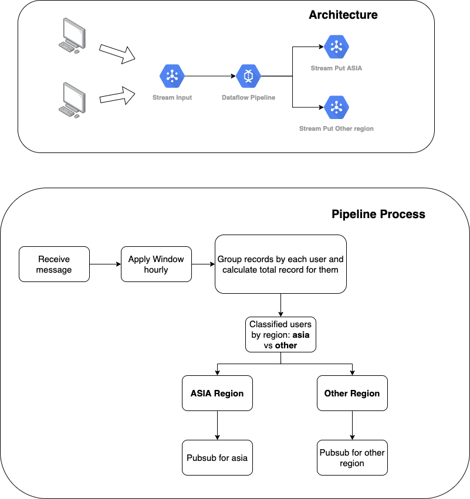

# etl-demo

## Problem
Our company create a game. We have a lot of players who join in game matches. In recently, we want analysis their records to find out Who is winner inside interval time. In this case, interval time is 1 hour

## Architecture

We use Pubsub service as data stream input which receive message about users from many resource. After that, we process data and synthesize them to explore best use each hour. Finally, the results will be send to other team through Pubsub.

## Notice
- Because this project is just used for demo, wherefore we don't supply configuration enough to run in production
- To illustrate user-playing, we build some small code **(scripts/illustrateMarkGame)** to generate ramdomly 
    records as 5 players are in one competition.
